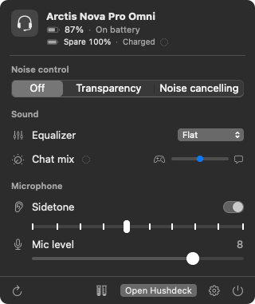
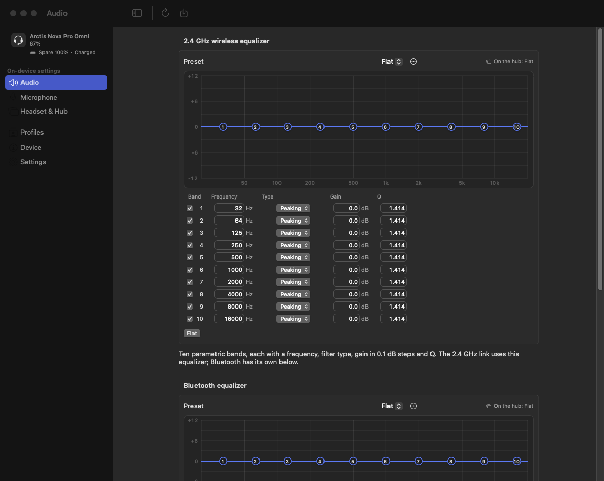

# Hushdeck

**A native macOS menu-bar app for the SteelSeries Arctis Nova Pro Omni.** No SteelSeries GG, no Windows VM, no background services: just a small SwiftUI app that talks to the headset's GameHub (the dock) directly over USB.

<p align="center">
  
</p>

SteelSeries GG doesn't support the Omni on macOS. Hushdeck fills that gap. It shows the battery in the menu bar and gives you the hub's on-device settings (equalizers, noise cancelling, sidetone, mic, OLED, Bluetooth) in a Mac-native window. Every setting it writes is stored on the hub itself, so it keeps working when you plug the dock into a console or another computer.

For other headsets Hushdeck falls back to [HeadsetControl](https://github.com/Sapd/HeadsetControl), so it also works as a battery and settings app for the many devices HeadsetControl supports.

> Hushdeck is an independent project. It isn't affiliated with, endorsed by or supported by SteelSeries. "SteelSeries", "Arctis" and "GG" are trademarks of their owners. It sends only commands that were checked against a real hub, and it hard-blocks firmware and reset commands, but you use it at your own risk.

## Features

**Menu bar and popover**
- Headset battery in the menu bar, plus the spare battery charging in the dock.
- Noise control: off, transparency, or noise cancelling with its level.
- Equalizer preset, sidetone and mic level.
- Live updates from the dock: the mute button, the ANC button, the volume dial and battery changes appear instantly.

**The Hushdeck window**

| Tab | What's in it |
|---|---|
| Audio | 10-band parametric equalizer for the 2.4 GHz link (frequency, filter type, gain, Q), 10-band Bluetooth equalizer, noise control, line-out / stream mix, volume limiter |
| Microphone | 10-band mic equalizer with the hub's mic presets, mic level, sidetone, mute-light brightness, noise reduction |
| Headset & Hub | auto-off timer, OLED brightness, home screen and screensaver, Bluetooth behaviour |
| Profiles | save every setting as a profile, switch between profiles, and import or export them as `.hushdeckprofile` files |
| Device | firmware versions and serial number |

<p align="center">
  
</p>

**Also**
- Your own EQ presets, saved locally.
- Hushdeck remembers your settings and sends them again when the dock reconnects (for example after it lost power).
- Notifications for low battery, a fully charged headset and a charged spare battery.
- Open at login.
- English and German.

### What's confirmed on real hardware

Every control was tested against a real Omni (hub firmware 1.28.0): written, read back and restored. That includes all three equalizers. The few things that haven't been seen on hardware yet carry an **Unverified** badge in the app:

- the spare battery reading, which hasn't been checked against a real battery swap;
- the ChatMix dial (by default the dock's dial is a volume knob; see [the protocol notes](protocol/protocol-notes.md#38-chatmix));
- the Bluetooth link details;
- save-to-flash. Hushdeck doesn't use it. It re-applies your settings instead.

## Requirements

- macOS 14 or later, Apple Silicon.
- An Arctis Nova Pro Omni, with the GameHub connected by USB. Any other headset needs [HeadsetControl](https://github.com/Sapd/HeadsetControl), which the release builds bundle.
- No drivers or extra permissions. The vendor HID interface needs no Input Monitoring permission.

## Install

There's no release yet, so build it yourself (it takes about a minute):

```sh
git clone https://github.com/eYdr1en/Hushdeck.git
cd Hushdeck/app
scripts/build-app.sh            # → app/dist/Hushdeck.app (ad-hoc signed)
open dist/Hushdeck.app
```

You need Xcode 26 or later (Swift 6.2). To bundle HeadsetControl for non-Omni headsets, install it first (`brew install headsetcontrol`); the build script picks it up automatically.

Once releases are published they'll be on the [Releases page](https://github.com/eYdr1en/Hushdeck/releases) as a zip. Hushdeck isn't notarised, so the first time you open it, choose **Open Anyway** in System Settings → Privacy & Security, or run `xattr -dr com.apple.quarantine /Applications/Hushdeck.app`.

## How it works

```
Hushdeck (SwiftUI MenuBarExtra + window)
 ├─ OmniKit            native USB HID driver for the Omni GameHub (IOKit, no dependencies)
 └─ HeadsetControlKit  runs the HeadsetControl CLI for every other headset
```

**OmniKit** (`app/Sources/OmniKit`) is a small, typed driver for the GameHub (`1038:2290`, HID interface 3):

- `OmniDevice` (an actor) reads the hub's full state on connect: status, audio settings, the three EQs, OLED settings, firmware and serial. After that it follows the hub's own change events, with a status poll as a fallback. The UI gets an `AsyncStream<OmniState>`.
- `OmniChannel` serialises every USB transfer and keeps them at least 50 ms apart.
- **Safety by construction.** There is no "send raw bytes" API. Packets can only be built from typed, range-checked settings. Firmware-update, reset and factory-reset opcodes are blocked twice: when a packet is built, and again right before it leaves. Bootloader PIDs are never opened. A golden test checks all 256 opcodes against the Python probe's verdicts.
- `SimulatedOmniTransport` is a byte-accurate fake hub, so the whole app runs and is tested without hardware.

More detail is in [`app/Sources/OmniKit/README.md`](app/Sources/OmniKit/README.md).

**HeadsetControlKit** runs `headsetcontrol -o json` as a separate process and shows only the controls the connected device reports. Hushdeck never links HeadsetControl's library (see [Licence](#licence)).

### The protocol

[`protocol/protocol-notes.md`](protocol/protocol-notes.md) documents the Omni's USB protocol: transport, every command and reply layout, the hub's events, the equalizer format and a list of commands that must never be sent. Each entry says whether it's confirmed on hardware. If you're adding Omni support to another tool (HeadsetControl, Linux, Windows), that's the file to read.

[`tools/probe.py`](tools/probe.py) is a careful command-line probe for the hub. It blocks the same commands as OmniKit, and writes are dry runs unless you pass `--really`:

```sh
cd tools && python3 -m venv .venv && .venv/bin/pip install -r requirements.txt
.venv/bin/python probe.py read status      # battery, charging, link, ANC…
.venv/bin/python probe.py listen           # print hub events live
```

## Development

```sh
cd app
make            # debug build
make test       # unit tests (no hardware needed)
make check      # warning-free build + tests + String Catalog check (what CI runs)
make app        # release build → dist/Hushdeck.app
make run        # run from source
```

Run without a headset:

| | |
|---|---|
| `HUSHDECK_SIMULATED_OMNI=1` | Use the simulated Omni hub (battery drains, spare charges, mute toggles) |
| `HUSHDECK_TEST_DEVICE=1` | Use HeadsetControl's `--test-device` |
| `HUSHDECK_TEST_PROFILE=N` | Test-device profile: `1` errors/offline, `2` charging, `10` limited capabilities, … |
| `-HushdeckSnapshot <dir>` | Render the popover and every window tab to PNGs and quit. Combine with `HUSHDECK_SIMULATED_OMNI=1` and `-HushdeckSnapshotAppearance light\|dark` |
| `-HushdeckWindowTab audio\|microphone\|hub\|profiles\|device\|settings` | Open the window on that tab at launch |

Tests against a real hub are opt-in. They read or change settings and always restore the originals:

| | |
|---|---|
| `OMNIKIT_LIVE_READ=1 swift test` | Read-only checks against a connected hub |
| `OMNIKIT_LIVE_WRITE=1 swift test` | Write, read back and restore every setting |
| `OMNIKIT_LIVE_EQ=1 swift test` | Upload a +2 dB change to each Custom EQ, read it back, restore |

### Translations

All user-facing text lives in one String Catalog, `app/Sources/Hushdeck/Resources/Localizable.xcstrings`, with English as the source language. After changing text, run `scripts/sync-strings.sh` and translate the new entries. To add a language, add it to the catalog in Xcode; no code changes are needed. Tests fail when a translation is missing, a placeholder doesn't match, or a string in the code isn't in the catalog.

### Releasing

`make release VERSION=x.y.z` builds a zip, its SHA-256 and a filled-in Homebrew cask (`packaging/homebrew/hushdeck.rb`) in `app/dist/`. CI (`.github/workflows/ci.yml`) builds and tests every push. For a `v*` tag it attaches those files to a **draft** GitHub release, together with the exact HeadsetControl commit it bundled.

## Repository layout

```
app/        Swift package: OmniKit, HeadsetControlKit, the Hushdeck app, tests, build scripts
protocol/   The Omni's USB protocol
tools/      Python probe for the GameHub
packaging/  Homebrew cask template
.github/    CI and release workflow
docs/       Screenshots
```

## Contributing

Issues and pull requests are welcome, especially:

- **Hardware reports.** If you have an Omni on a different firmware version, run `OMNIKIT_LIVE_READ=1 swift test` and `probe.py read firmware`, and open an issue with the output.
- **The unverified features:** ChatMix, save-to-flash, the spare battery.
- **Translations.**

Before adding a new hub command, document it in `protocol/protocol-notes.md` and add it to `probe.py`'s allowlist, so it has a reference encoding (see OmniKit's README).

## Licence

Hushdeck is released under the [MIT licence](LICENSE).

HeadsetControl is GPL-3.0. Hushdeck doesn't link its library or include any of its source; it runs the `headsetcontrol` program as a separate process. Release builds bundle that program together with its licence (and HIDAPI's), and Settings → About shows both. Anyone who redistributes such a bundle has to meet the GPL's source terms for the bundled binary; the release notes record the exact HeadsetControl commit for that reason.
